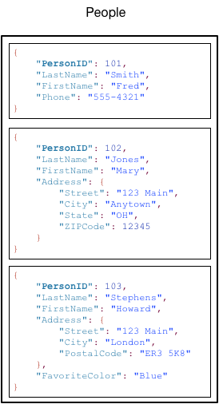

# 一、概述
DynamoDB是一种完全托管的NoSQL数据库，提供快速可预测的性能，同时可以无缝扩展。使用DynamoDB可以无需考虑硬件配置问题，扩展或减缩表容量也不会导致停机问题。可以使用AWS管理控制台来监控各种性能指标。

# 二、核心组件
## 1.表、项目、属性
表、项目和属性是使用DynamoDB的核心组件。表示项目的集合，项目是属性的集合。  
DynamoDB中使用主键来唯一标识表中的每个项目，使用二级索引来进行更灵活的查询。  

* 表 --类似其他数据库表的概念，是一类数据的集合。例如People表，包含所有人的数据。
* 项目 --类似其他数据库表中行、记录、元组的概念，DynamoDB对表中可存储的项目数量没有限制。例如people1，包含一个人的数据。
* 属性 --类似其他数据库表中列的概念，是基础的数据元素，不需要进一步分解。例如name、age，表示一个人的属性。

* 表中的每一个项目都有一个唯一的标识符或主键，用于和表中其他项目区分开来。
* 与主键不同，表是无架构的，这表示属性和项目类型不需要预先定义。每个项目都可以拥有自己的独特属性。
* 某些属性可以嵌套表示，DynamoDB最高支持32级嵌套深度。

## 2.主键
创建DynamoDB表时，除表名称外，还必须指定表的主键。主键唯一标识表中的每个项目，任意两个项目的主键肯定不同。

* 分区键(partition key) -- 简单主键，由一个称为分区键的属性构成。  
DynamoDB使用分区键的值作为内部散列函数的输入，来自散列函数的输出决定了项目将存储到的分区（DynamoDB内部的物理存储）。  
在只有分区键的表中，任意两个项目不能有相同的分区键。
* 分区键和排序键(partition key & sort key) -- 复合主键，由分区键和排序键组合构成。第一个属性是分区键，第二个属性是排序键。  
DynamoDB使用分区键的值作为内部散列函数的输入，来自散列函数的输出决定了项目将存储到的分区。具有相同分区键值的所有项目将按排序键值的排序顺序存储在一起（相互紧邻的物理位置）。  
在具有分区键和排序键的表中，任意两个项目可以有相同的分区键，但是排序键一定不同。

主键属性允许的的数据类型是字符串、数值、二进制。其他非主键属性没有此限制。

## 3.二级索引
DynamoDB允许在表上创建一个或多个二级索引。二级索引提高了数据查询的灵活性。

DynamoDB支持两种二级索引：
* 全局二级索引 --分区键和排序键都和基表不同。
* 本地二级索引 --分区键和基表相同，但排序键不同。

每个表具有20个全局二级索引（默认配额）和5个本地二级索引的配额。  
Music表包含一个名为GenreAlbumTitle 的新索引。在索引中，Genre 是分区键，AlbumTitle 是排序键。

关于二级索引：
* 每个索引属于一个表（称为索引的基表）。
* DynamoDB将自动维护索引。当在基表中添加、更新或删除某个项目时，DynamoDB会添加、更新或删除属于该表的任何索引中的对应项目。
* 创建索引时，可以指定哪些属性将从基表中复制或投影到索引。DynamoDB默认至少会将键属性从基表投影到索引中。

## 4.DynamoDB Streams
DynamoDB Streams是可选功能，用于捕获DynamoDB表中的数据修改事件。有关这些的事件的数据将以事件发生的顺序近乎实时的出现在流中。  
如果您对表启用流，则每当以下事件之一发生时，DynamoDB Streams 都会写入一条流记录：
* 向表中添加了新项目：流将捕获整个项目的映像，包括其所有属性。
* 更新了项目：流将捕获项目中已修改的任何属性的“之前”和“之后”映像。
* 从表中删除了项目：流将在整个项目被删除前捕获其映像。

每条流记录还包含表的名称、事件时间戳和其他元数据。流记录具有 24 个小时的生命周期；在此时间过后，它们将从流中自动删除。
